Atividade 03 - Grafo de visibilidade de robô

# Problema:-------------------------------------------------

1 - Ler o arquivo do mapa

2 - Construir grafo de visibilidade

3 - Montar árvore de custo mínimo com Kruskal e Prim

4 - Determinar o vértice da árvore mais próximo de uma posição definida

5 - Implementar busca em árvore com a técnica que se sentirem mais confortável

6 - Testar cenário em que o robô está já em um vértice da árvore e um outro em que o robô não está.

```
import numpy as np
```
Considere o problema de planejamento de caminho para veículos autônomos. Existem formas diferentes de representar o mapa em que o algoritmo de planejamento deve atuar. Em uma atividade anterior, nos preocupamos com mapas definidos por células, agora vamos trabalhar com uma representação topológica do ambiente (a versão mais à esquerda na figura abaixo).

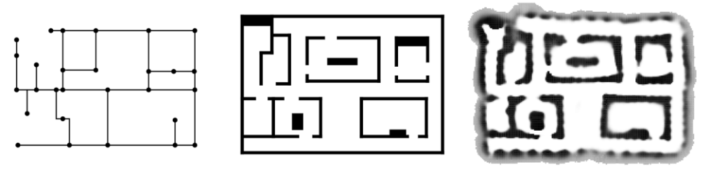

Podemos montar esse tipo de mapa, em um espaço poligonal, com uma técnica conhecida como Grafo de Visibilidade. A técnica pode ser observada no início do capítulo Roadmaps do livro Principles of Robot Motion. Em resumo, consideramos como vértices regiões de interesse, como a posição inicial e desejada do robô, além dos pontos de "quinas" dos obstáculos.

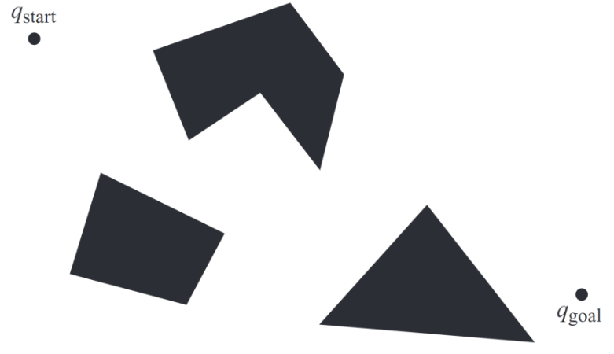

```
# Considere que o arquivo esteja no formato a seguir:
# q_start_x, q_start_y
# q_goal_x, q_goal_y
# <numero de obstaculos>
# <numero de quinas>
# x_quina, y_quina
# ...

def lerVertices(arquivo):
  # escrever código
  return V
```
Dizemos que existe aresta entre dos vértices se houver visada direta entre eles, ou seja, se montamos uma linha reta entre os dois pontos, não há obstáculo, o robô se mantém no espaço de configurações livres de colisão. Podemos formalizar essa característica com a seguinte combinação convexa:

eij≠∅⇔svi+(1−s)vj∈cl(Qfree) 

Será preciso resolver um problema de Point-In-Polygon para saber se algum ponto no decorrer da combinação convexa está no interior de um dos obstáculos. Fica como dica a biblioteca shapely, mas se sintam livres para usar outras abordagens. Considere como custo da aresta a distância entre os vértices.

Gerando um grafo como o a seguir:

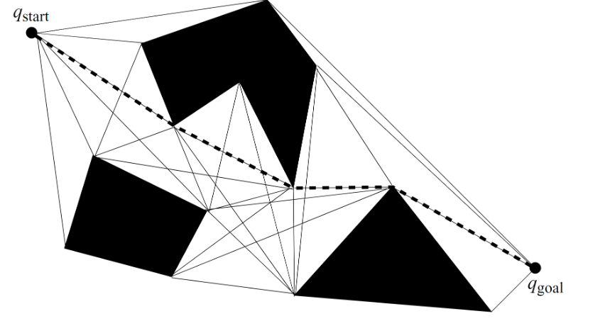

```
def montarGrafoVisibilidade(V):
  # Escrever código
  return G
```

O grafo resultante serve como roadmap, não só para ir de  qstart  para  qgoal , mas permite planejar caminhos do veículo para outras regiões do mapa. Tudo isso usando técnicas de teoria dos grafos. Sabendo que o veículo sempre inicia em uma certa posição, podemos explorar algoritmos de busca ainda mais eficientes na estrutura da árvore. Pretende-se então descobrir qual a árvore que passa por todos os vértices e o custo total é mínimo. Esse problema pode ser trabalhado com os algoritmos de Kruskal e Prim, implemente ambos algoritmos.

```
def mstKruskal(G):
  # Escrever código
  return T

def mstPrim(G):
  # Escrever código
  return T
```

Caso o robô inicie em um local não contemplado com um vértice, podemos fazer um caminho até o vértice mais próximo e de lá seguir o roadmap para o local desejado. Portanto, precisamos de uma rotina que descubra qual o vértice do grafo mais próximo dado um ponto no plano.

```
def verticeMaisProximo(T, posicao):
  # Escrever código
  return vértice
```

Agora é possível encontrar o caminho para  qgoal . Para isso, pode ser usada uma técnica padrão de busca de árvore, seja busca por largura, profundidade ou mesmo A*.

```
def computarCaminho(T, pos_inicial, pos_final):
  v_inicial = verticeMaisProximo(pos_inicial)
  v_final = verticeMaisProximo(pos_final)
  # Escrever código
  return path

pos_inicial = np.array([1, 10])
pos_final = np.array([10, 1])
```

Da mesma forma, para um par de pontos aleatórios do mapa.

```
pos_inicial = ...
pos_final = ...

path = computarCaminho(T, pos_inicial, pos_final)
```

# Solução: ----------------------------------------------------------------

A resolução é feita em 2 arquivos, o ***main.py*** que responsável pela parte da resolução do problema, o ***grafo.py*** que serve para criar No e Aresta(funções para gerenciamento de um grafo).
 
Na ***Primeira parte*** do problema e gerado o grafo através da entradas dos arquivos ***mapa.txt***, onde na função
  
 > criar_grafo(G,arq)
 
Em ***main.py*** e recebe um objeto do tipo grafo é um arquivo contendo como entrada: 
> qstart,

> qgoal,

> quantidade de objetos presente no mapa, 

> quantidade de quinas de cada objeto e suas respectivas posições no plano XY.

Assim criando um novo vértice do grafo para cada quina do objeto e para entradas independentes, no caso qstrat e qgoal.

Com os vértices criados vamos criar as primeiras arestas, que será às arestas que delimitam os objetos, formando um polígono, que também será usado para impedir que criar aresta que tenha intersecção ou passe por dentro com objetos no mapa.

Também ao criar o vertices pelas quinas do objetos vamos salvar os pontos que delimitar o poligonos para futura verificação de Point-In-Polygon, e para cada vértice vamos identificar a que objeto pertence para evitar criar aresta entre vértices do mesmo objeto, que usaremos na ***Segunda parte*** do problema.

Após criamos os vértices e as arestas delimitadoras do polígonos como mostrado na figura abaixo.

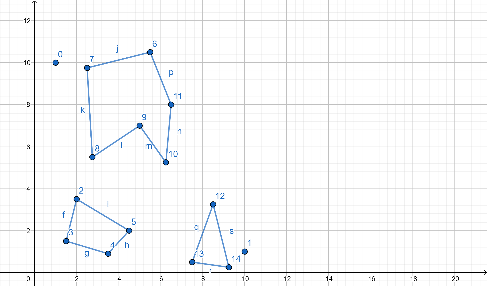

Na ***Segunda parte*** do problema, vamos criar as aresta de visão direta, como indicado no problema, na função: 

> criar_arestas(G)

Em ***main.py***, no qual será criada as arestas que não tiver nem um ponto em comum com as aresta já criadas, isto é, serão os segmentos de retas que não possuir intersecção como algum lado do polígono, que será identificado pela função:

> intersecao(x1,y1,x2,y2,x3,y3,x4,y4)

Que está no mesmo arquivo, na qual recebe 4 pontos do tipo XY, assim sendo os ***dois primeiros o segmento de reta entre os vértices que desejamos*** criar as arestas, e os ***dois últimos os do segmento de reta de um dos lados do polígono***.Caso não exista nem uma intersecção com nem um lado dos polígonos ***poderá*** ser criado a aresta. Após verificar que não existe intersecção, será verificado se estes dois vértices pertencem ao mesmo polígono, pela numeração marcada quando criado os vértices, se sim,isto é, se pertencer ao mesmo obstáculo, temos que calcular o ponto médio desta nova aresta e testas se ele está dentro de algum polígono, através do Point-In-Polygon, para evitar que crie aresta dentro do polígono ou aresta erradas de polígonos não convexo(tipo um estrela), caso este ponto não faça parte, podemos criar a aresta por fim. Assim será criado as outras arestas com na figura abaixo:

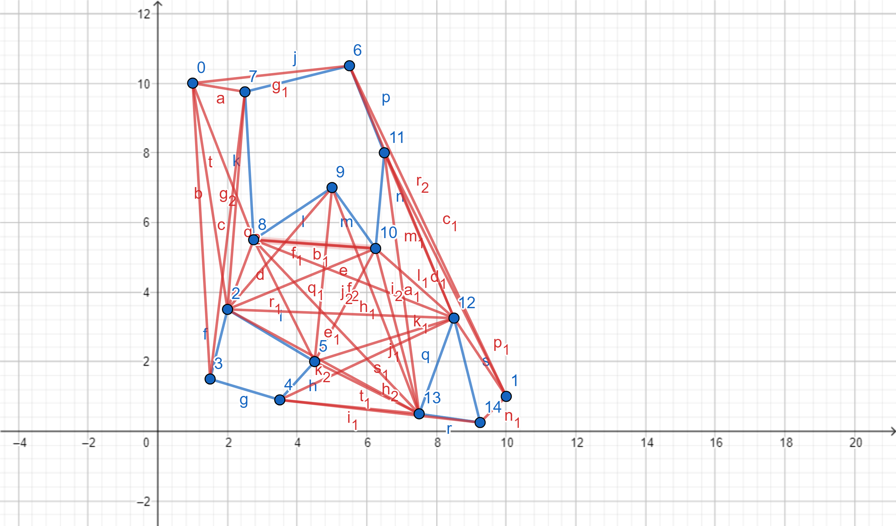

Após criados todas as arestas termos o grafo de visibilidade abaixo:

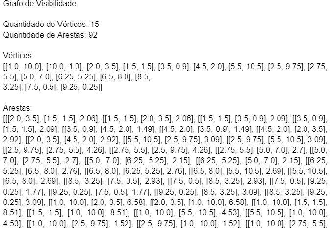
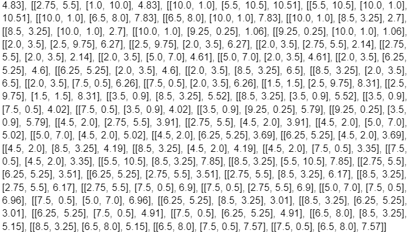

Na ***Terceira parte*** do problema, iremos criar a árvore geradora mínima atráves do grafo de visibilidade criado acima, que será criado através da função:

> Prim(self,qstrat)

Dentro do arquivo ***grafo.py***, onde pelo algoritmo de Prim vamos selecionar as arestas que possuírem o menor custo, até que todos os vértices estejam interligados sem formar ciclos, isto é a árvore tem que ser conexo e acíclico. Assim que completo teremos um subgrafo do grafo de visibilidade, que será salvo no grafo T(Tree), como mostrado abaixo:

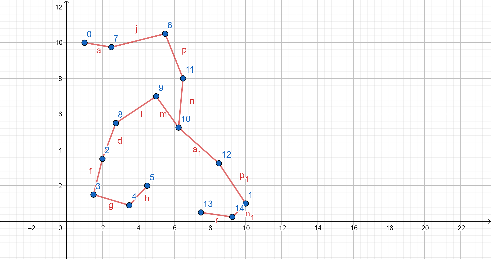
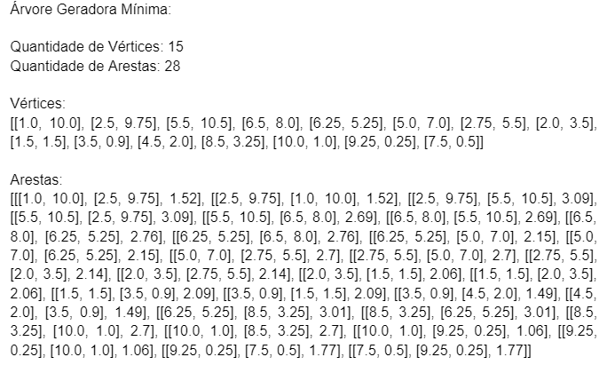

Na ***Quarta parte*** do problema, vamos iniciar a busca na árvore de qstart até qgoal, mais antes, existe um subproblema e quando o robô não está em um vértice, então antes teremos que  calcular o vértice mais próximo na árvore de onde o robô para iniciar a buscar na árvore, assim através da função:

> verticeMaisProximo(T, posicao)

Em ***main.py*** que irá calcular a menor distância e salvar o vértice mais próximo da posição do robô, caso robô inicie em uma posição não possível, isto é, dentro de um objeto, não haverá busca, e o caminho será vazio.

Na ***Quinta parte*** do problema, será calculado, se possível o caminho de Qstrat a Qgoal, pela função

> Busca_Profundidade(self,qstrat,qgoal)

Em ***grafo.py***, assim será percorrido a árvore até achar qgoal e imprimir o caminho, como mostrado nos caso abaixo:

Caso 1: Qstrat e Qgoal dados no Arquivo:

 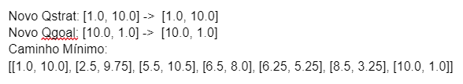

Caso 1: Qstrat e Qgoal aleatório:

 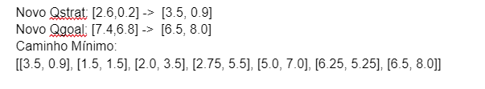
 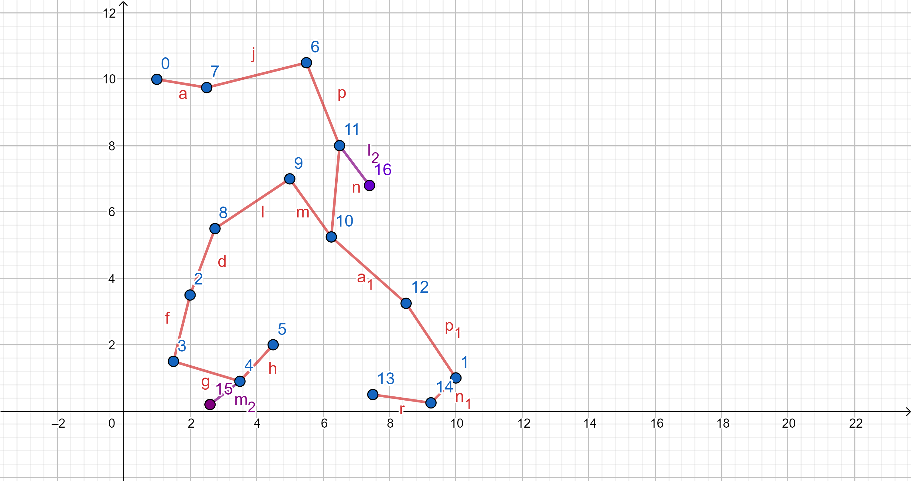

Caso 1: Qstrat e Qgoal aleatório, com Qstart dentro de um objeto:

 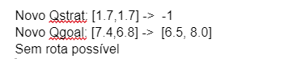
 
 Mesmo não explicito no desenho da árvore, o ponto (1.7,1.7) está dentro do objeto é não e possível "sair" de dentro, então não chegarar em Qgoal. 
